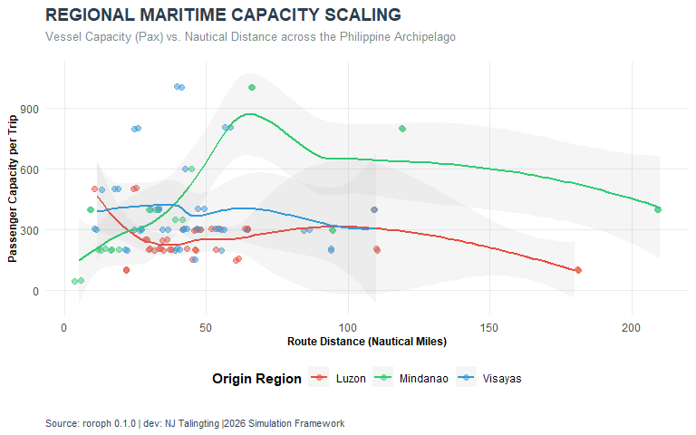

# roroph: Philippine Roll-on/Roll-Off (RoRo) Connectivity and Transport Data

## Overview
The `roroph` package provides a standardized, machine-readable geospatial dataset of the primary and missionary routes comprising the Philippine Nautical Highway System. This includes 108 bidirectional provincial links across the Western, Central, and  Eastern Nautical Highways, complete with GADM-standardized naming,  geospatial coordinates, and metrics such as distance, travel time,  and vessel frequency within the 2024-2026 operations.

Unlike traditional distance-based spatial models, `roroph` sees the Philippine archipelago through Network Topology. The package provides the necessary edge-list and node-attribute data to move beyond simple Euclidean distance (d) and into Frictional Connectivity, accounting for:

**Node Adjacency:** Directed links between 40+ coastal provinces.

**Temporal Friction:** Average travel time in hours (T) across the sea-gap.

**Flow Capacity:** Daily frequency (f), passenger capacity, and cargo volume.

## Key Features
**Mapping the Core Philippine Maritime Network:** We can visualize the RoRo links as segments connecting provincial capitals. We can color-code them by their MARINA Highway classification (Western, Central, Eastern, or Missionary) through which the strength of connection is determined by daily frequency travel.

<p align="center">
  
  <br>
  <i><b>Figure 1:</b> Spatial Connectivity and Daily Frequency of the Philippine RoRo Maritime Network</i>
</p>

**Statistical Analysis:** Beyond visualization, we can use `roroph` for statistical analyses as it provides necessary variables such as distance, travel time,  and vessel frequency within the 2024-2026 operations. For instance, we could analyze the relationship between distance and vessel capacity among the three major island groups in the Philippines.

<p align="center">
  
  <br>
  <i><b>Figure 2:</b> The relationship between distance and vessel capacity in the Philippines' major island groups.</i>
</p>

**Construction of the Frequency-Based Weights ($W$):** `roroph` provides the raw infrastructure (the Edges) and the native functions to construct Frequency-Weighted Matrices (W). In an archipelagic context, Euclidean distance becomes a limitation as it ignores the physical constraints of the ocean that moves the Philippine economy. By defining the "nearness" of two provinces by the bandwidth of their maritime connection, `roroph` enables researchers to capture the spatial signal found in national price transmission.

While `roroph` defines the Spatial Weights, it is designed to be the primary data-input for the `ArchipelagoEngine` (v0.1.2) package. The engine utilizes these maritime weights to perform Maximum Likelihood Estimation, correcting for the residual spatial bias (p < 0.05) often found in terminal nodes and land-border clusters.

## Installation
For v0.1.1:
```
install.packages("roroph")
````
## Quick Start
````
library(roroph)
library(dplyr)
library(sf)

# Load the network data
data(roro_routes)

# Example 1: Basic Analysis of Connectivity
# Calculate the average passenger capacity per highway system
roro_routes %>%
  group_by(highway_type) %>%
  summarise(mean_pax = mean(pax_cap, na.rm = TRUE))

# Example 2: Zoom in to one of the provincial links
# Filter for the Western Nautical Highway (WNH) hubs
wnh_hubs <- roro_routes[roro_routes$highway_type == "Western", ]

# Simple validation check of coordinates 
if (requireNamespace("sf", quietly = TRUE)) {

# Check if coordinates are within the Philippine bounding box
  bbox_check <- all(wnh_hubs$from_lat > 4 & wnh_hubs$from_lat < 21)
  message("Coordinate validity: ", bbox_check)
}
````
## Disclaimer
The maritime industry in the Philippines is highly dynamic. While the routes, distances, and MARINA codes in this package are based on official 2024–2026 administrative reports from the Maritime Industry Authority (MARINA) and the Philippine Ports Authority (PPA), users should note:

**Operational Status:** Routes may be temporarily suspended due to weather (e.g., tropical cyclones), maintenance, or regulatory grounding of specific fleets.

**Variable Metrics:** Values for freq_daily (frequency) and pax_cap (capacity) are representative averages. Actual daily throughput fluctuates based on seasonal demand (e.g., Holy Week, Christmas) and private operator schedules.

**Navigational Use:** This dataset is for statistical and spatial modeling purposes only. It is NOT intended for actual marine navigation. Always consult official Notices to Mariners (NOTAMs) and PPA port advisories for real-time travel planning.

**User Responsibility:** Users are encouraged to verify critical data points against the latest MARINA sectoral releases when using this package for policy-making, logistics planning, among other academic and commercial usage.

The `roroph` package is an independent development and is separate from and not recognised and approved by MARINA and PPA. The author and maintainer of this package is not affiliated with these orgnanizations but is committed to ensuring that the `roroph` package is compliant with its terms of use.

## Community Guidelines
Feedback, bug reports and feature requests are welcome; file issues or seek support [here](https://github.com/njtalingting/roroph/issues). If you would like to contribute to the package through informing the author of a newly established maritime route that connects provinces, please create a pull request. 
